# VinhNgo-FanDuel-Coding-Challenge — NFL Depth Chart

Welcome to my attempt at FanDuel Coding Challenge, this was written by [Vinh Ngo](https://github.com/vinhngogia0906) as the submission for the take home technical test.

[](https://github.com/vinhngogia0906/VinhNgo-FanDuel-Coding-Challenge/actions/workflows/ci.yml)

> Submission for the FanDuel Trading Solutions Coding Challenge — an in-memory
> NFL depth-chart engine exposed as a REST API, with a thin React + TypeScript
> UI for hands-on exploration and a full automated test suite.

## Contents

- [What's implemented](#whats-implemented)
- [Quick start](#quick-start)
- [Step-by-step verification](#step-by-step-verification)
- [Architecture](#architecture)
- [Assumptions and trade-offs](#assumptions-and-trade-offs)
- [How I'd extend this](#how-id-extend-this)
- [Tests](#tests)
- [CI](#ci)
- [Project layout](#project-layout)

---

## What's implemented

The four operations from the spec, exposed both as in-process domain methods and
as HTTP endpoints so the demo UI (and the reviewer) can drive them:

| Spec operation | HTTP endpoint |
|----------------|---------------|
| `addPlayerToDepthChart`      | `POST   /api/sports/{sport}/teams/{team}/depthchart` |
| `removePlayerFromDepthChart` | `DELETE /api/sports/{sport}/teams/{team}/depthchart/{position}/{number}` |
| `getBackups`                 | `GET    /api/sports/{sport}/teams/{team}/depthchart/{position}/{number}/backups` |
| `getFullDepthChart`          | `GET    /api/sports/{sport}/teams/{team}/depthchart` |

Plus:

- **Per-sport position validation** (NFL/NBA/NHL/MLB) via FluentValidation — the
  same code base extends to MLB/NHL/NBA by registering an additional position
  catalog.
- **Multi-position players** are handled correctly (e.g. Josh Wells at LT *and* RT).
- **Spec example replays exactly** as shown in the assignment PDF — see the
  step-by-step verification below.
- **OpenAPI** at `http://localhost:5113/openapi/v1.json`.
- **Health endpoint** at `http://localhost:5113/health`.

---

## Quick start

### Option 1 — Docker (recommended; zero local dependencies beyond Docker)

```powershell
git clone https://github.com/vinhngogia0906/VinhNgo-FanDuel-Coding-Challenge.git
cd VinhNgo-FanDuel-Coding-Challenge

docker compose up --build -d
```

Wait ~30 seconds for the `engine` container to reach `healthy`, then open:

| Surface | URL |
|---------|-----|
| **UI**         | http://localhost:5173 |
| **API root**   | http://localhost:5113 |
| **OpenAPI**    | http://localhost:5113/openapi/v1.json |
| **Health**     | http://localhost:5113/health |

You should see this in your Docker Desktop:

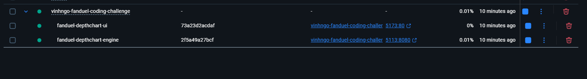

To stop:

```powershell
docker compose down
```

### Option 2 — Run locally (faster iteration; needs .NET 10 SDK + Node 22)

```powershell
# Backend
cd src/FanDuelDepthChartEngine/FanDuelDepthChartEngine.Api
dotnet run --launch-profile http        # binds http://localhost:5113

# UI (in another shell)
cd src/fanduel-depthchart-ui
npm install
npm run dev                              # binds http://localhost:5173
```

### Option 3 — Run all tests

```powershell
# .NET unit tests (Domain + Application + Validation)
dotnet test src/FanDuelDepthChartEngine/FanDuelDepthChartEngine.slnx

# UI component + E2E (Playwright)
cd src/fanduel-depthchart-ui
npm run test:component
npm run test:e2e
```

---

## Step-by-step verification

Below is the exact happy-path the reviewer can walk through. Every step has the
expected screen state captured under `screenshots/`. **If your screen
matches the screenshot, the step is correct.**

> All steps assume Option 1 above is running (UI on `:5173`, API on `:5113`).

---

### Step 1 — Open the UI

Navigate to **http://localhost:5173**. The page loads with a default position of
`QB` pre-filled and an empty depth chart.

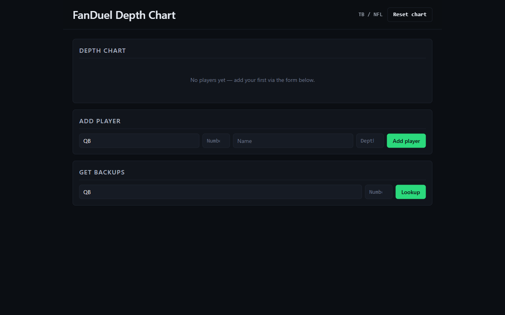

**What to look for:** the heading "FanDuel Depth Chart — TB (NFL)", three section
headers ("Add player", "Get backups", "Full depth chart"), and the friendly
empty-state placeholder under the chart section.

---

### Step 2 — Add Tom Brady at QB depth 0

In the **Add player** form, fill in:

| Field    | Value      |
|----------|------------|
| Position | `QB`       |
| Number   | `12`       |
| Name     | `Tom Brady`|
| Depth    | `0`        |

Click **Add**. A success toast appears, the form clears, and the chart now shows
Brady on the QB row.

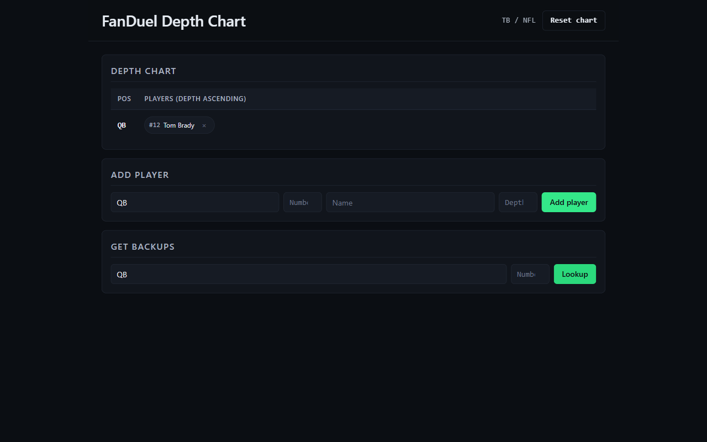

**What to look for:** a single QB row with `(#12, Tom Brady)` and a remove ✕
icon next to it.

---

### Step 3 — Add the rest of the QB depth chart

Repeat Step 2 with:

| Position | Number | Name           | Depth |
|----------|--------|----------------|-------|
| `QB`     | `11`   | `Blaine Gabbert` | `1` |
| `QB`     | `2`    | `Kyle Trask`     | `2` |

The QB row now shows all three players in depth order — Brady, Gabbert, Trask.

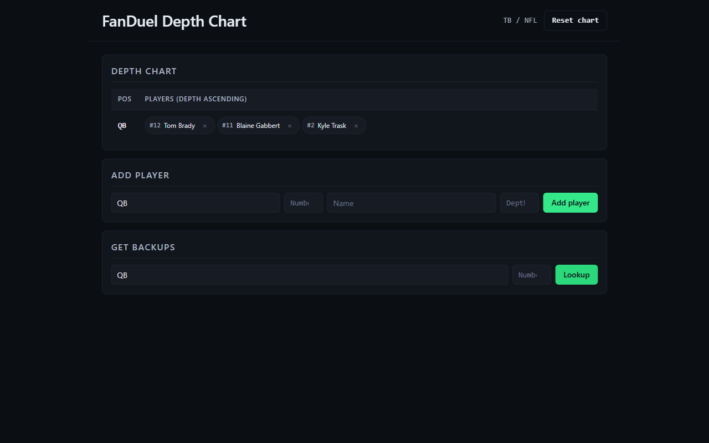

**What to look for:** the QB row shows three players left-to-right in starter-
to-third-string order. Numbers are right-aligned tabular.

---

### Step 4 — Add the LWR (Left Wide Receiver) depth chart

Add three more players:

| Position | Number | Name             | Depth |
|----------|--------|------------------|-------|
| `LWR`    | `13`   | `Mike Evans`     | `0`   |
| `LWR`    | `1`    | `Jaelon Darden`  | `1`   |
| `LWR`    | `10`   | `Scott Miller`   | `2`   |

The chart now shows two rows, exactly mirroring the spec's worked example.

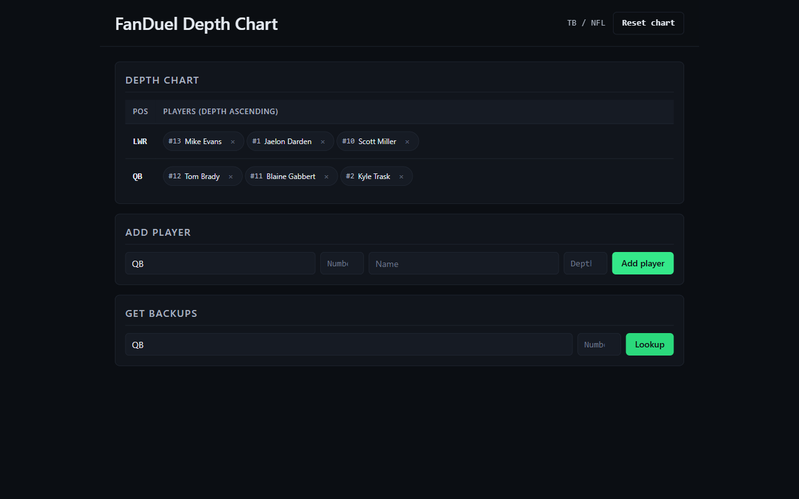

**What to look for:** two rows (`QB`, `LWR`), each with three players in depth
order. This is the canonical assignment example from the PDF.

---

### Step 5 — Look up backups for Tom Brady (QB starter)

In the **Get backups** form, fill in `Position = QB`, `Number = 12`. Click
**Lookup**.

Expected output:
```
#11 – Blaine Gabbert
#2 – Kyle Trask
```

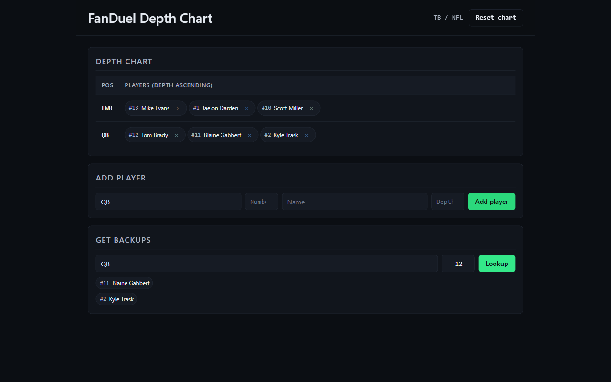

**What to look for:** two players returned in depth order — exactly mirrors the
spec's `getBackups("QB", TomBrady)` example.

---

### Step 6 — Look up backups for the third-string QB

Fill in `Position = QB`, `Number = 2` (Kyle Trask). Click **Lookup**.

Expected output: a friendly empty-state — *"No backups for QB #2 (Kyle Trask)"*.

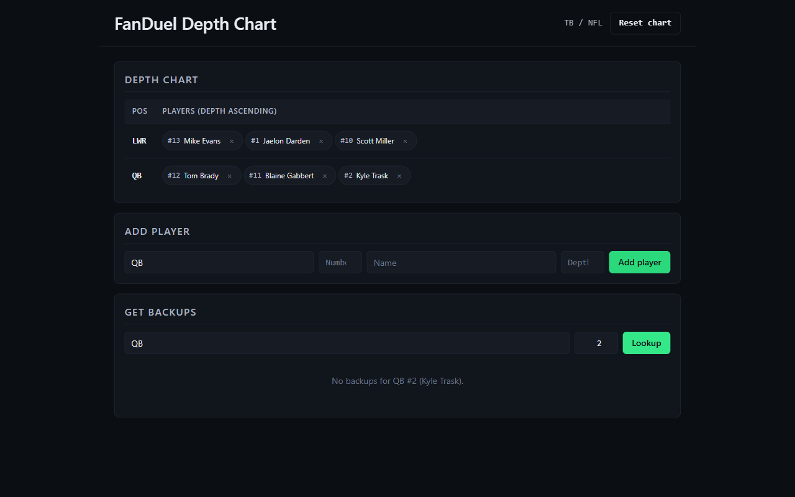

**What to look for:** an explicit empty-state message; the spec calls this the
`<NO LIST>` case.

---

### Step 7 — Look up backups for a player who's NOT at the queried position

Fill in `Position = QB`, `Number = 13` (Mike Evans — he's on `LWR`, not `QB`).
Click **Lookup**.

Expected output: empty — *"No backups for QB #13"*.


**What to look for:** the system returns empty per the spec's prose
*"An empty list should be returned if the given player is not listed in the
depth chart at that position."* This step exists because the spec's printed
example for this case is contradictory — see [Assumptions](#assumptions-and-trade-offs).

---

### Step 8 — Multi-position support: Josh Wells at LT *and* RT

The spec calls out Josh Wells as a player listed at both Left Tackle and Right
Tackle. Add him twice:

| Position | Number | Name        | Depth |
|----------|--------|-------------|-------|
| `LT`     | `78`   | `Josh Wells`| `1`   |
| `RT`     | `78`   | `Josh Wells`| `1`   |

Both rows now show #78 Wells.

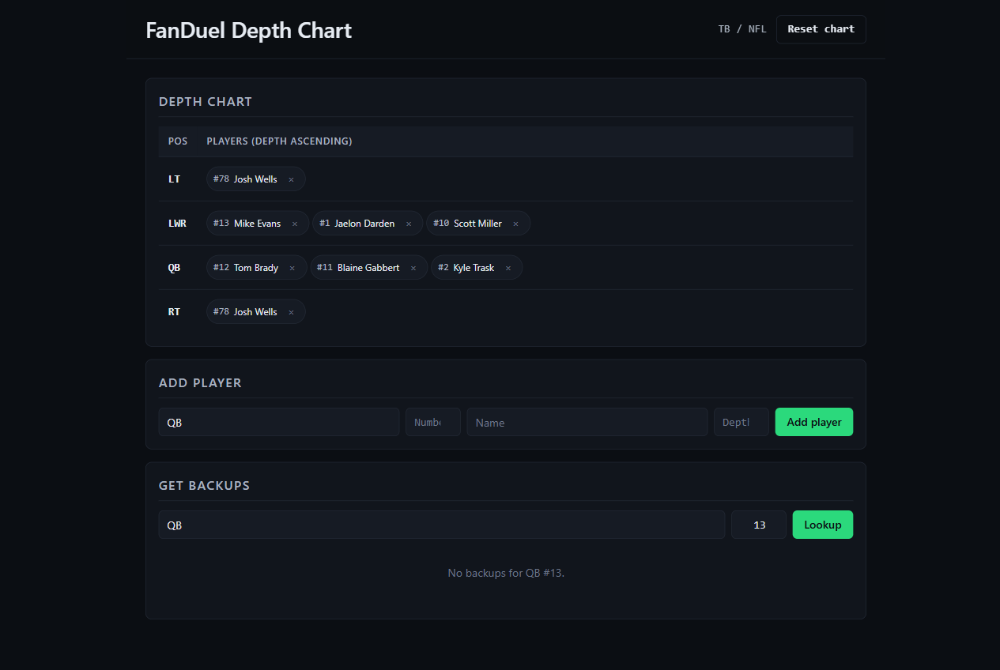

**What to look for:** Wells appears in both `LT` and `RT` rows. The same player
(by jersey number) can occupy multiple positions on the chart.

---

### Step 9 — Remove a player

Click the ✕ button next to **#13 Mike Evans** on the `LWR` row.

The row compacts: Darden moves to depth 0, Miller to depth 1, and a toast
confirms the removal returned `#13 – Mike Evans`.

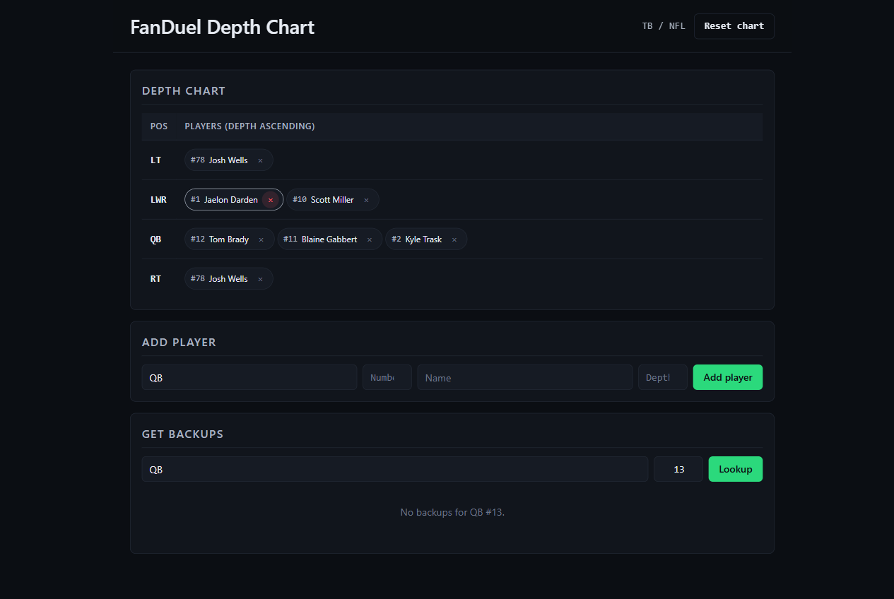

**What to look for:** the row has shifted left; only Darden and Miller remain
on `LWR`, in that order.

---

### Step 10 — Validation / error feedback

Try to add a player with an invalid jersey number (e.g. `Number = -1`). The
backend's FluentValidation rejects the request with a 400, and the UI surfaces
the error message in a banner.

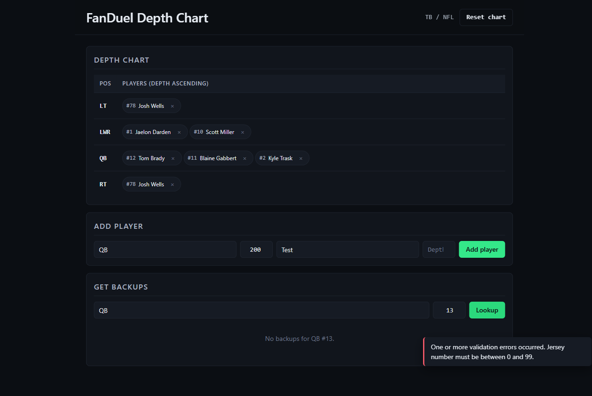

**What to look for:** an inline error message explaining what went wrong; the
form is not cleared so the user can correct it. No silent failures.

---

### Step 11 — Final populated chart

After all the above, the chart should look like this — the canonical TB depth
chart for the demo.

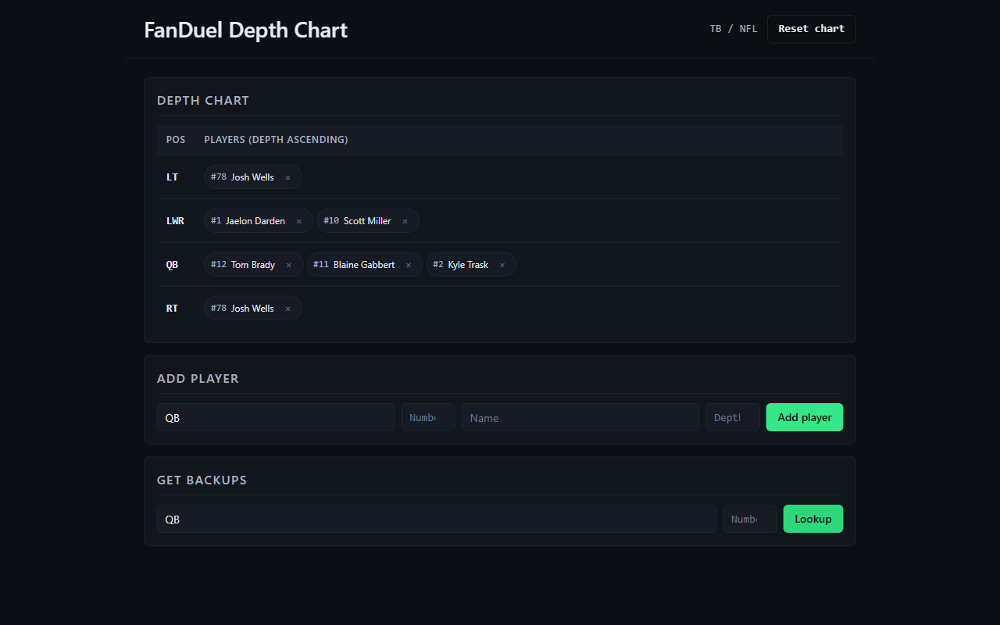

**What to look for:** four populated rows (`QB`, `LWR`, `LT`, `RT`), depth-
ordered, with consistent typography and spacing.

---

### Step 12 — Mobile / narrow viewport

Resize the browser to ~480px wide. The layout reflows to a single column with
chips wrapping inside their position rows; nothing overflows or clips.

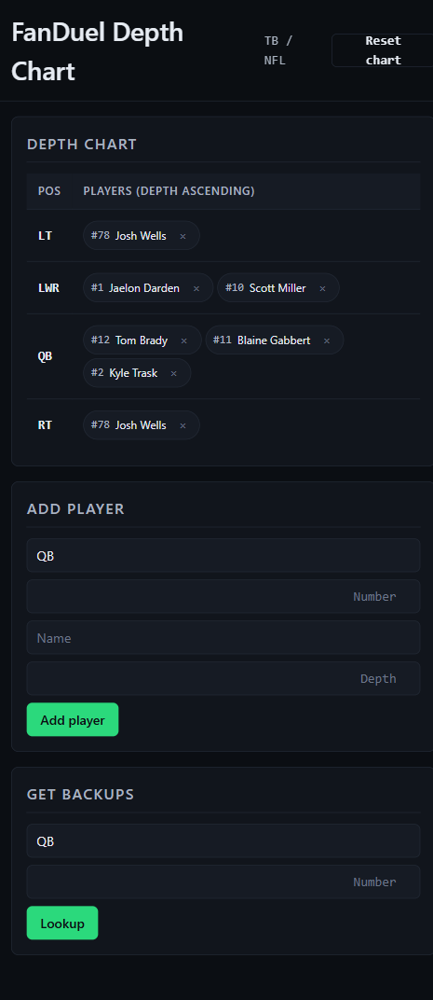

**What to look for:** form inputs stack vertically, chart rows wrap cleanly,
the ✕ buttons remain tappable.

---

## Architecture

Clean-architecture-flavoured layered solution:

```
┌──────────────────────────────────────────────────────────┐
│  React + TypeScript UI (Vite)                            │
│  - Add player form                                       │
│  - Backups lookup                                        │
│  - Full chart with chip-per-player rendering             │
└────────────────────────┬─────────────────────────────────┘
                         │ HTTP / JSON
┌────────────────────────▼─────────────────────────────────┐
│  FanDuelDepthChartEngine.Api  (ASP.NET Core 10 Minimal)  │
│  - /api/sports/{sport}/teams/{team}/depthchart/...       │
│  - FluentValidation at the boundary                      │
│  - OpenAPI document                                       │
└────────────────────────┬─────────────────────────────────┘
                         │ DI
┌────────────────────────▼─────────────────────────────────┐
│  FanDuelDepthChartEngine.Application                     │
│  - DepthChartService (the four use cases)                │
│  - IDepthChartRepository                                 │
│  - ISportPositionCatalogProvider                         │
└────────────────────────┬─────────────────────────────────┘
                         │
┌────────────────────────▼─────────────────────────────────┐
│  FanDuelDepthChartEngine.Domain   (pure C# — no I/O)     │
│  - DepthChart aggregate                                  │
│  - Player, PositionCode value objects                    │
│  - SportPositionCatalog (NFL/NBA/NHL/MLB)                │
└────────────────────────┬─────────────────────────────────┘
                         │
┌────────────────────────▼─────────────────────────────────┐
│  FanDuelDepthChartEngine.Infrastructure                  │
│  - InMemoryDepthChartRepository                          │
│  - InMemorySportPositionCatalogProvider                  │
└──────────────────────────────────────────────────────────┘
```

**Why this shape for a four-method spec?** The "Important Notes" section of the
assignment explicitly asks how the solution scales to other sports and to all 32
NFL teams. Layering with an `IDepthChartRepository` interface and a per-sport
`SportPositionCatalog` is the cheapest way to demonstrate "ready for those
extensions" without building them.

---

## Assumptions and trade-offs

The spec has a handful of internal contradictions and unspecified edges. Each
was resolved as follows:

1. **Backups inversion in spec prose vs. examples.** The spec line "backups have
   *lower* position_depth" is inverted relative to its own worked examples.
   I followed the **examples** — depth `0` is the starter, and backups are
   players with **higher** depth indices. (Verified by every example output in
   the spec.)
2. **Empty list for player-not-at-position.** The spec's example
   `getBackups("QB", JaelonDarden)` returns `Scott Miller`, but Darden is on
   `LWR`. The spec's prose says "empty list when not at position." I implemented
   the **prose**, treating the example as a typo. See Step 7 above for the
   verification.
3. **Idempotent re-add.** The spec says jersey numbers are unique within a team.
   Adding the same player at the same position twice is a **no-op** rather than
   a duplicate or an error — the user's intent is clear, and silently
   duplicating would corrupt the chart.
4. **Multi-position is supported.** The spec explicitly calls out Josh Wells at
   LT and RT (Step 8); the same `Player` can appear on multiple position rows.
5. **No persistence.** Storage is in-memory via `IDepthChartRepository`. Swapping
   to SQL/Redis is one new class — the domain doesn't change.
6. **No authentication / rate limiting / multi-tenancy.** Out of scope for the
   take-home; mentioned here so it's clearly an explicit choice, not an
   oversight.
7. **Position codes are normalised** (uppercase, trimmed) at the application
   boundary so `qb`, `Qb`, and ` QB ` are the same row.
8. **The `ourlads.com` URL is reference data only.** Nothing scrapes it. The
   four operations work on data the caller supplies.
9. **HTTP/REST is not strictly required by the spec** but was added so the
   review can be hands-on. The four spec operations remain accurate as plain
   in-memory methods on the `DepthChart` aggregate.

---

## How I'd extend this

- **MLB / NHL / NBA** — register a new `SportPositionCatalog` instance. Domain
  unchanged; the FluentValidation cross-field rule rejects non-MLB codes for
  MLB teams. See `SportPositionCatalog.MLB` for the shape.
- **All 32 NFL teams** — already supported. Charts are keyed by
  `(sportId, teamId)` in `InMemoryDepthChartRepository`. Adding teams is data,
  not code.
- **Persistence** — replace `InMemoryDepthChartRepository` with an EF Core /
  Dapper / Redis implementation. Single seam, no other changes.
- **Live feed integration** — add an importer that consumes
  `ourlads.com/nfldepthcharts/depthchart/{TEAM}` (or a paid feed like
  Sportradar) and replays the data through `AddPlayer`. The domain doesn't
  care where calls come from.
- **Audit log** — wrap `DepthChartService` in a decorator that publishes
  domain events to Kafka. Trading would subscribe and re-price markets in
  real time.

---

## Tests

```powershell
# .NET unit tests
dotnet test src/FanDuelDepthChartEngine/FanDuelDepthChartEngine.slnx

# UI component + E2E
cd src/fanduel-depthchart-ui
npm run test:component        # Playwright Component Testing
npm run test:e2e              # Playwright E2E against the Docker stack
```

| Project | What it covers |
|---------|----------------|
| `FanDuelDepthChartEngine.Domain.Tests`      | The spec's verbatim example + 8 edge cases (idempotent re-add, multi-position, out-of-range depth, unknown position, unknown player, position normalisation). |
| `FanDuelDepthChartEngine.Application.Tests` | Service delegation (mocked repository via Moq) + FluentValidation rules per sport. |
| `tests/component/` (UI)                     | AddPlayerForm submit payload, DepthChartTable rendering + remove handler, empty state. |
| `tests/e2e/` (UI)                           | Replays the spec example end-to-end through the UI; verifies multi-position + remove + empty-backups paths. |

Coverage is tracked via Coverlet; the cobertura report is uploaded as a CI
artifact on every run.

---

## CI

Every push and PR runs:

| Job        | What it does |
|------------|--------------|
| `backend`  | restore → build → unit test → upload .trx + coverage |
| `ui`       | `npm ci` → typecheck → build → lint |
| `component`| Playwright Component Testing in Chromium |
| `docker`   | Build both images (cached via GHA) |
| `e2e`      | Bring up `docker compose`, run Playwright E2E, upload report on failure |

See `.github/workflows/ci.yml`.

---

## Project layout

```
.
├── docker-compose.yml
├── src/
│   ├── FanDuelDepthChartEngine/
│   │   ├── FanDuelDepthChartEngine.slnx
│   │   ├── FanDuelDepthChartEngine.Api/
│   │   ├── FanDuelDepthChartEngine.Application/
│   │   ├── FanDuelDepthChartEngine.Application.Tests/
│   │   ├── FanDuelDepthChartEngine.Domain/
│   │   ├── FanDuelDepthChartEngine.Domain.Tests/
│   │   └── FanDuelDepthChartEngine.Infrastructure/
│   └── fanduel-depthchart-ui/
│       ├── src/
│       │   ├── components/
│       │   ├── api/
│       │   └── App.tsx
│       ├── tests/
│       │   ├── component/
│       │   └── e2e/
│       ├── playwright.config.ts
│       └── playwright-ct.config.ts
├── docs/
│   └── screenshots/                 ← step-by-step verification images
└── .github/workflows/ci.yml
```

---

## Submission checklist

- [x] All 4 spec operations implemented and unit-tested.
- [x] Spec's verbatim example replays exactly through the UI.
- [x] Multi-position case (Josh Wells) supported.
- [x] Solution extends to MLB/NHL/NBA via `SportPositionCatalog`.
- [x] Solution extends to all 32 NFL teams (charts keyed by `(sport, team)`).
- [x] Edge cases tested: idempotent re-add, unknown player/position, out-of-range depth.
- [x] FluentValidation at the API boundary.
- [x] Docker compose for one-command launch.
- [x] GitHub Actions CI green.
- [x] Playwright component + E2E tests.
- [x] README walks through the demo with screenshots.

---

*Submitted by **VINH NGO** for the FanDuel Trading Solutions Coding Challenge.*
